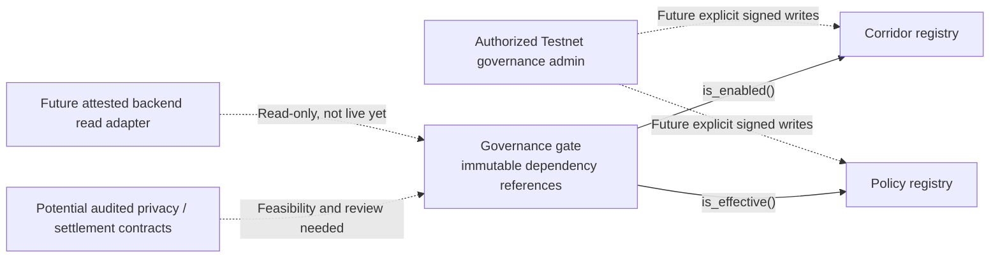

# Soroban Architecture and Delivery Plan

> Rust / Soroban SDK 27.0.6 · Stellar **Testnet-only** source workspace · reproducibly built, not deployed. No privacy verifier, real asset transfer, custody or fiat payout contract is verified.

## Why the contracts are small

StealthBridge needs **public governance signals** without making confidential transaction information public. A registry can say that an operator authorized an opaque corridor or policy flag; it cannot prove the operator has liquidity, a licensed fiat provider, a confidential stablecoin, a verified proof, or a customer authorization.

The current Soroban workspace has three crates:

| Crate | Responsibility | Not its responsibility |
| --- | --- | --- |
| `contracts/corridor-registry` | Public corridor enabled/disabled flags, admin handover, pause and storage TTL | Actual payout eligibility, exchange price, funds transfer |
| `contracts/policy-registry` | Public versioned commitments, administrative updates, revocation and pause | Enforcing private limits or validating a ZK witness |
| `contracts/governance-gate` | **Read-only** Soroban cross-contract lookup: true only if corridor and policy flags agree; fail closed | A private-payment verifier, custodial router, legal eligibility oracle |

All privileged registry writes use Soroban authorization; emergency pauses reject newly enabled entries while allowing authorized disabling. All three contracts are compiled and tested under the pinned toolchain, including real local cross-contract call tests. **No verified contract IDs exist in the checked-in Testnet manifest.**

## Dependency architecture



The gate's `public_flags_allow(corridor,policy)` must fail for empty/oversized IDs, unavailable dependencies, paused registries, invalid return shapes, and incompatible calls. A true result means **both public flags are effective**, not permission to move value.

## Data disclosure boundaries

On-chain deployment, admin accounts, transactions, storage keys, timing, and contract invocation footprints are public. A hashed or opaque corridor identifier is not automatically confidential. Contracts should never emit protected payment amounts, customer relationships, raw witnesses, secret notes or PII as events or arguments.

The Business and Send product lines require **different proof and privacy assumptions**:

- **Business / confidential values:** institutional counterparties may be known while approved balances/amounts are concealed. Issuer/operator privileges, viewing, freeze/revoke, supply and redemption constraints require explicit policy and legal analysis.
- **Send / private relationships:** sender/recipient linkage may be concealed within a supported shielded protocol, but funding/withdrawal edges and metadata can still correlate activity. Client note custody/recovery and nullifier safety are critical.
- **Transparent Stellar assets:** ordinary Stellar/SAC assets remain observable by default. A mint, transfer, deposit, redemption, or swap is not made private merely by calling a governance registry.

Do not build a custom cryptographic protocol from a marketing requirement. Evaluate pinned, independently maintained Stellar privacy primitives, prove actual compatibility on Testnet, and commission security review before a fund-moving contract is implemented.

## Contract security invariants

1. Every privileged mutation has narrowly scoped `require_auth()` authorization and negative authorization tests.
2. Admin rotation is explicit and auditable; define upgrade authorities, key loss, emergency pause and recovery procedures.
3. Pausing blocks new enabled governance entries; disabling during pause must remain available.
4. Instance/persistent TTL, restoration and fees are measured; read calls do not mask expired data as active.
5. Immutable gate references mean wrong registry addresses require a new gate instance and new independent attestation.
6. No unchecked downstream call or storage exception may result in a positive eligibility flag.
7. Never store private witness data or count simulated privacy proofs as valid.
8. Manifest claims are separate from network transactions, bytecode checks and independent verification.

## Reproducible build and provenance

The workspace pins Rust 1.91.0, Stellar CLI 27.1.0, Soroban SDK 27.0.6, and `wasm32v1-none`. `scripts/artifacts.py` builds all three contracts in **two isolated release environments**, compares WASM bytes, extracts ABIs and publishes per-contract SHA-256 hashes.

```sh
cargo fmt --all -- --check
cargo test --workspace --locked
cargo clippy --workspace --all-targets --locked -- -D warnings
cargo build --workspace --locked --target wasm32v1-none --release
python3 -m unittest discover -s scripts -p 'test_*.py'
python3 scripts/artifacts.py
python3 scripts/verify_artifacts.py
python3 scripts/validate_manifest.py
python3 scripts/preflight_testnet.py
```

`scripts/verify_artifacts.py` rejects swapped or tampered WASM, ABI and checksum records. `scripts/preflight_testnet.py` validates the undeployed manifest, build provenance and optionally Testnet RPC identity/freshness and a public administrator G-address. `scripts/verify_onchain_wasm.py` can **later** fetch actual deployed Testnet WASM for comparison with approved artifact hashes—only when real operator-supplied C-addresses exist. None of these tools signs or submits a transaction.

## Proposed Testnet deployment ceremony

1. Choose a separately approved Testnet operator **public G-address**; keep signing keys in operator-controlled wallet/hardware/CLI configuration.
2. Rebuild and verify artifacts from the exact reviewed commit; record source SHA, hashes, SDK/CLI/protocol versions and a clean tree.
3. Verify Testnet RPC and ledger freshness with the read-only preflight.
4. **After explicit human approval**, deploy the corridor registry with an authorized admin, then the policy registry, then the gate bound to both independently attested deployed addresses.
5. Obtain actual successful transaction hashes and C-addresses; independently fetch WASM and verify admin, pause, constructor references and TTL.
6. Upgrade the existing **single-contract deployment manifest schema** to a reviewed three-contract attestation format; synchronize into backend and SDK. Never retroactively infer deployment from source CI.
7. Introduce safe public on-chain **reads** first; keep `payment_execution_enabled=false`.
8. Only pursue private settlement/asset adapters after formal threat review, verified upstream privacy proofs, wallet-authorization controls and external compliance evaluation.

See the [operator runbook](../deployments/testnet/OPERATOR-DEPLOYMENT-RUNBOOK.md). The existing manifest remains `not-deployed`.

## Protocol roadmap

| Milestone | Work | Acceptance gate |
| --- | --- | --- |
| C1 — Governance source | Three well-tested contracts and cross-registry negative tests | Native CI, WASM CI, auth/TTL/pause evidence |
| C2 — Deployment release engineering | Reproducible hashes, artifact verifier, network preflight and operator procedure | Independent local rebuild and signed operator deployment review |
| C3 — Real Testnet governance | Verified deployed contract IDs, source/bytecode signatures and gate binding | On-chain independent reads, reproducible ABI, manifest v2 |
| C4 — Privacy feasibility | Compare confidential token vs private payment primitives, metadata disclosure and recovery | Actual proof vectors, measurable security/performance evidence |
| C5 — Financial protocol | Versioned settlement, issuer and policy integration after feasibility | Adversarial/fuzz/replay tests, audit, compliance/legal gates and observed Testnet completion |

**Do not set delivery dates for C4/C5 before cryptographic and operational prerequisites exist.** A security review can block a launch even after a successful CI run.

## Contributor map

- [Current code](../contracts/) · [Public source interface](../integrations/public-soroban-interface.v1.json)
- [Architecture](PROTOCOL-ARCHITECTURE.md) · [Security boundaries](WALLET-REGISTRY-BOUNDARIES.md) · [Threat model](THREAT-MODEL-v0.2.md) · [Privacy feasibility](PRIVACY-FEASIBILITY-MATRIX.md)
- [Operator deployment](../deployments/testnet/OPERATOR-DEPLOYMENT-RUNBOOK.md) · [Verification](REGISTRY-VERIFICATION.md) · [Roadmap](../ROADMAP.md)
- [Organization platform direction](https://github.com/stealthbridge-labs/.github/blob/main/docs/PLATFORM-VISION-AND-ARCHITECTURE.md)

Cross-repo API consumers must stay disabled until versioned and independently verified on-chain evidence exists. No secrets, actual funded wallet exports or confidential proofs belong in issues, code or README examples.
