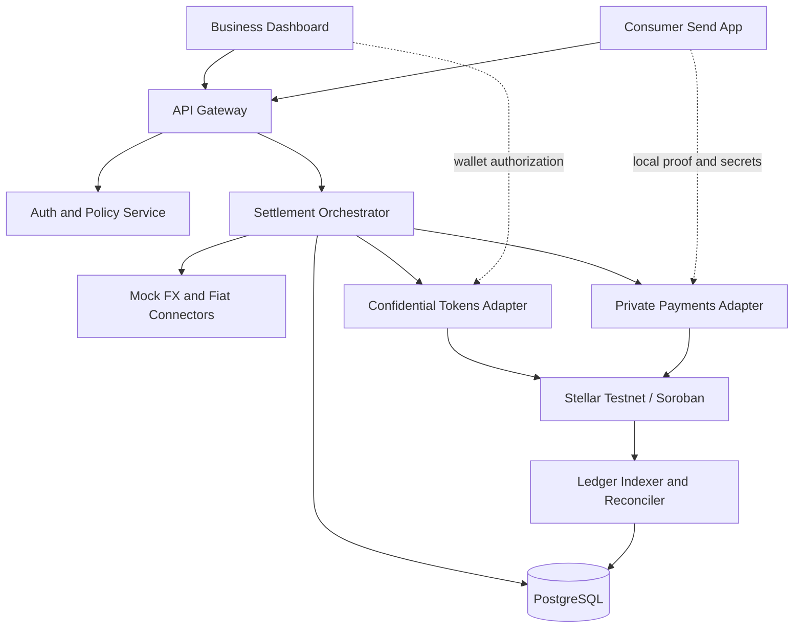

# System Architecture — Draft v0.1

## Proposed logical flow

This is a **candidate design**, not a claim that the privacy SDKs are interchangeable or that any particular contract supports composable cross-contract private settlement.

## Boundaries
- **Client/wallet**: control keys and create authorization/proofs where supported; never send secrets to the API by default.
- **API/orchestrator**: authenticated requests, quote checks, idempotency, settlement journal, off-chain risk checks, read models.
- **Soroban contracts**: only rules requiring tamper-resistant enforcement, selected after testing protocol interoperability.
- **Privacy adapters**: isolate differing transfers, note models, and proof APIs. Do not assume a common transfer primitive.
- **External rails**: simulated FX prices and payout providers until regulated partnerships exist.

## Proposed settlement states
`draft` → `quoted` → `authorized` → `submitted` → `onchain_finalized` → `payout_pending` → `payout_completed`

Exceptional states: `expired`, `rejected`, `chain_failed`, `payout_failed`, `refund_pending`, `refunded`, `manual_review`.

Enforce allowed transitions; never mark payout complete solely from a chain event. Retries require stable business identifiers and separate disbursement references.

## Data and operations
- PostgreSQL for settlement attempts, status journal, quotes, corridor config, off-chain metadata and idempotency keys.
- Ledger indexer for confirmations and reorg/finality semantics; treat duplicate events idempotently.
- Store only minimum necessary personally identifying info, ideally with regulated partners rather than in the platform.
- Never store raw ZK witness, notes, spend keys or wallet secret keys in logs or analytics.
- Add tracing with correlation IDs that don't disclose transfer participants in public systems.

## Security requirements
Threat-model keys, note backups, operator privileges, quote forgery/replay, double-spend, tampered proofs, malicious provider webhooks, refund races, and public metadata correlation.

## Feasibility gates
1. Pin toolchain versions and deploy one vanilla Confidential Tokens transfer on testnet.
2. Pin and exercise one SPP shield/transfer/unshield testnet round trip.
3. Test wallet signatures, client-side proof generation, verification and asset compatibility.
4. Establish whether custom Soroban contracts can gate or compose with each backend; otherwise orchestrate explicitly through supported off-chain flows.
5. Document observed on-chain disclosures using transaction traces.
